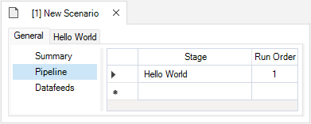

# Getting started with **helloworld**

---
## ⚠️ **Notice to Users**

The **Getting Started** documentation and associated **Tutorials** for this SyncroSim package currently reflects information for **SyncroSim version 2**. We are in the process of updating these pages to ensure compatibility with **SyncroSim version 3**.
In the meantime, please note that some instructions, references, and/or images may not fully align with the latest version of SyncroSim. We appreciate your patience as we work to provide updated resources.

---

## Quickstart Tutorial

1\. Download and install SyncroSim 3.0.19 or later from <a href="https://syncrosim.com/download/" target="_blank">https://syncrosim.com/download/</a>.

2\. Install the *helloworld* package in SyncroSim Studio by selecting **File > Local Packages > Install from Server...**.

3\. Create a new *helloworld* library.
  * In SyncroSim, select **File > New > Empty Library...**.
  * Name the file **helloworld Example** (ok to keep default) and save the library to a desired *Folder* location. Click **Save**.
  * In the *Explorer* window, right click on the **helloworld Example** library name and select **Open** from the context menu.
  * Under the **General** tab, select **Packages**. Click **Add** to open the *Add Package* window, and select **helloworld**. Press **OK**.

4\. First, check your executable location by clicking on **helloworld Example** library in the <a href="https://docs.syncrosim.com/how_to_guides/library_overview.html" target="_blank">*Explorer*</a> window, and then selecting **Open** from the context menu. Under the **System** tab, navigate to **Tools > R** to check and/or set the location of your R program executable.

5\. To edit the scenario inputs, right-click on the auto-generated empty **New Scenario** in the <a href="https://docs.syncrosim.com/how_to_guides/library_overview.html" target="_blank"> *Explorer*</a> window and select **Open**. Under the **General** tab, click on **Pipeline** and set the *Stage* to *Hello World* - it will automatically have a *Run Order* of *1*.

6\. Under the **Hello World** tab, select **Inputs** and enter pairs of values for your **x** and **a** model inputs in the grid. **Save** the library.

7\. To run the scenario, right-click on this **New Scenario** again in the <a href="https://docs.syncrosim.com/how_to_guides/library_overview.html" target="_blank"> *Explorer*</a> window and select **Run**.

8\. Once the run is complete, return to the <a href="https://docs.syncrosim.com/how_to_guides/library_overview.html" target="_blank">*Explorer*</a> window. Expand the node beside the **New Scenario** to reveal a **Results** folder containing your results, then expand the node beside the **Results** folder to show the newly generated date/time stamped results scenario. Each results scenario contains a read-only snapshot copy of all your inputs at the time of your run, along with values for your model generated outputs.

9\. Right-click on this results scenario and select **Open** to view the details of this results scenario; you will find your calculated outputs in the **Hello World > Outputs** window.

For the complete tutorial on how to create the *helloworld* package, see the <a href="https://docs.syncrosim.com/how_to_guides/package_create_overview.html" target="_blank">creating a package</a> tutorial in the <a href="https://docs.syncrosim.com/" target="_blank">SyncroSim documentation</a>.
