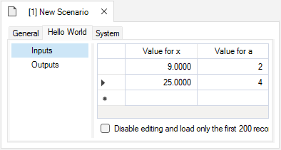
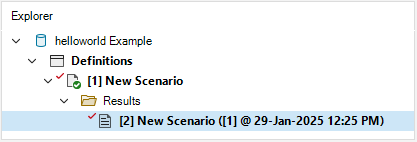
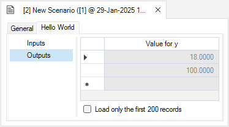

# Getting started with **helloworld**

## Quickstart Tutorial

1. Download and install SyncroSim 2.2.27 or later from <a href="https://syncrosim.com/download/" target="_blank">https://syncrosim.com/download/</a>.

2. Install the *helloworld* package in the SyncroSim user interface by selecting **File \| Packages \| Install...**
 
 
3. If you need to update package versions, in SyncroSim go to **File \| Packages \| Update...**
 
 
4. Create a new *helloworld* Library
  * In SyncroSim, select **File \| New Library...**
  * Select the *helloworld* base package and choose the *Empty Library* template.
  * Enter a **Filename** (ok to keep the default) and a **Folder** for your new Library, then click **OK**.
 
 
3. First, check your executable location by clicking on **helloworld** Library in the <a href="https://docs.syncrosim.com/how_to_guides/library_overview.html" target="_blank">Library Explorer</a>, and then selecting **Library Properties** from the **File** menu. Select the **R Configuration** tab to check and/or set the location of your R program executable.
 
 
4. To edit the Scenario inputs, right-click on the auto-generated empty **New Scenario** in the <a href="https://docs.syncrosim.com/how_to_guides/library_overview.html" target="_blank">Library Explorer</a> and select **Properties**. Then select the **Inputs** tab and enter pairs of values for your **x** and **a** model inputs in the grid.
 

 
 
5. To run the Scenario, right-click on this **New Scenario** again in the <a href="https://docs.syncrosim.com/how_to_guides/library_overview.html" target="_blank">Library Explorer</a> and select **Run**.
 
 
5. Once the run is complete, return to the <a href="https://docs.syncrosim.com/how_to_guides/library_overview.html" target="_blank">Library Explorer</a>. Expand the node beside the **New Scenario** to reveal a **Results** folder containing your results, then expand the node beside the **Results** folder to show the newly generated date/time stamped *Results Scenario*. Each *Results Scenario* contains a read-only snapshot copy of all your inputs at the time of your run, along with values for your model generated outputs.
 

 
 
6. Right-click on this *Results Scenario* and select **Properties** to view the details of this *Results Scenario*; you will find your calculated outputs under the **Outputs** tab.  
 

 
 

For the complete tutorial on how to create the *helloworld* Package, see the [creating a package](https://docs.syncrosim.com/how_to_guides/package_create_overview.html) tutorial in the [SyncroSim documentation](https://docs.syncrosim.com/).
